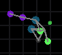

# evolution-simulation
This program simulates emergence and natural selection in biological systems using a few basic components.

<p align="center">
  
</p>
<figcaption align = "center"><b>Sample execution</b></figcaption>


## Organism Mechanics
Organisms are represented with nodes in a graph, each color representing a specific node element.

<p align="center">
  
</p>
<figcaption align = "center"><b>An organism!</b></figcaption>

Each node has an energy property (represented by brightness) that must
be kept above zero to prevent the organism from starving. This can
be achieved through consuming food particles or predation.

<p align="center">
  
</p>
<figcaption align = "center"><b>Food producers and particles</b></figcaption>


If an organism has enough energy, it can duplicate its reproductive node 
which will then grow into fully a developed organism. Organisms have "DNA" which is represented
through code containing lines of nodes to create and which nodes to connect to.

### Node Table
| Tag      | Description | Color |
| ----------- | ----------- | -----------|
| nod      | Structural, no effect       | Dark violet
| eat   | Consume food for energy        | Teal
| rot   | Rotate randomly        | Pink
| jit   | Jitter randomly        | Lavender 
| pre   | Siphon energy from other organisms        | Red
| rep (cannot be coded) | Organize growing and duplication | Grey

### Example Code
```
eat 0
rot 0
nod 0
nod 3
nod 4
nod 5
nod 6
jit 7
```
<p align="center">
  
</p>
<figcaption align = "center"><b>Organism created from code example</b></figcaption>

Multiple node connections can be made in one line.
```
eat 0
eat 0 1
eat 0 1 2
jit 0 2
```
When an organism duplicates, its code can contain errors through
swaps, deletions, and insertions. Over time, many organism
types can be created.

<p align="center">
  
</p>
<figcaption align = "center"><b>Evolution</b></figcaption>
Experiment with the starting conditions to see what organisms
you can create!