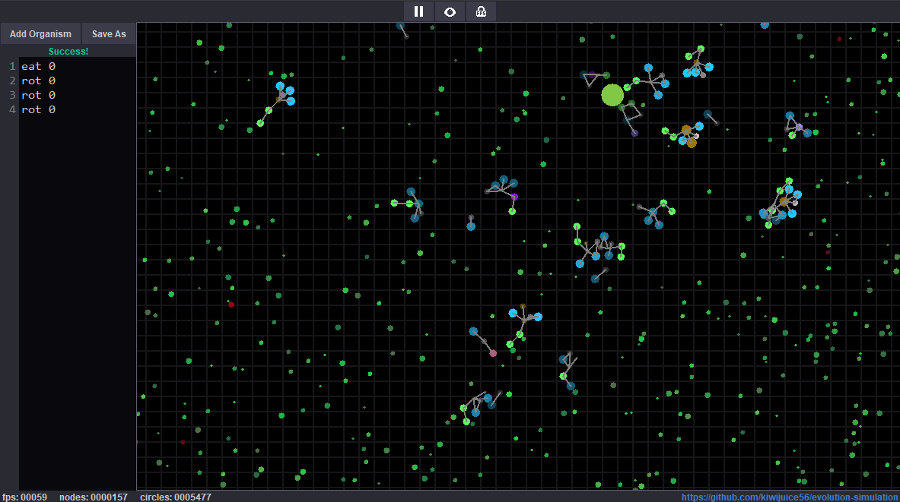
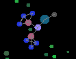
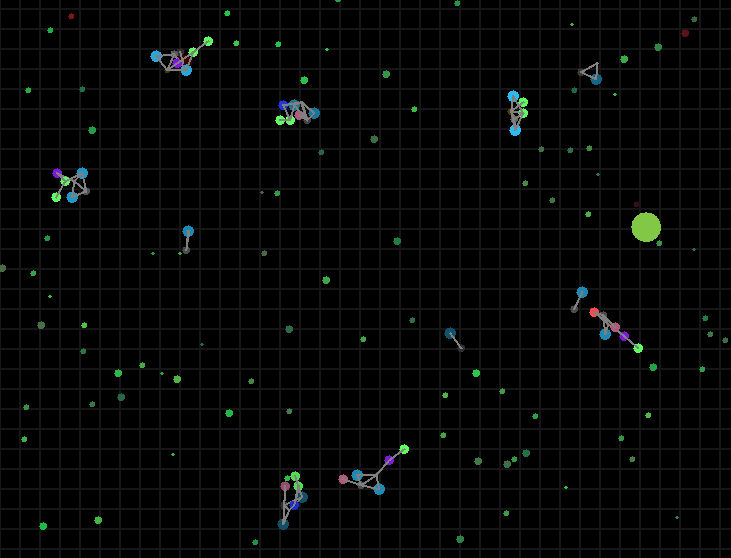

#  evolution-simulation 
 This program simulates emergence and natural selection in biological systems using a few basic components.

<p align="center">
  
</p>
<p align="center"><b>Sample execution</b></p>


## Organism Mechanics
Organisms are represented with nodes in a graph, each color representing a specific node element.
Each line represents a bidirectional connection in the graph organism.

<p align="center">
  
</p>
<p align="center"><b>An organism!</b></p>

Each node has an energy property (represented by brightness) that must
be kept above zero to prevent the organism from starving. This can
be achieved through consuming food particles or predation. Nodes lose energy over time and viruses
can deplete energy more quickly.

<p align="center">
  
</p>
<p align = "center"><b>Food producers and particles</b></p>

<p align="center">
  
</p>
<p align = "center"><b>Virus producers and particles</b></p>

Organisms have "DNA" which is represented
through code containing lines of nodes to create and which nodes to connect to. You can create
your own organisms through the program's code editor.
As the organism gains energy, it will read through its code and add nodes with their
respective connections.
If an organism has enough energy, it can duplicate its reproductive node and code
which will then grow into fully a developed organism.

### Node Table
| Tag   | Col | Description |
| ----- | ----------- | -----------|
| `nod` |  | Structural, strong virus resistance
| `eat` |  |  Consume food for energy, low resistance 
| `run` |  | Moves away from other organisms
| `jit` |  | Jitter randomly 
| `rot` | |  Rotate randomly
| `fol` |  | Moves towards other organisms 
| `pre` |  | Siphon energy from other organisms 
| `sto` |  | Radius changes with energy, high max energy 
| `gat` |  | Moves towards food circles
| `rep` |  |  (cannot be coded) Organizes growing and replication

### Example Code
```
eat 0
rot 0
nod 0
nod 3
nod 4
nod 5
nod 6
jit 7
```
<p align="center">
  
</p>
<p align = "center"><b>Organism created from code example</b></p>

Also, multiple node connections can be made in one line.
```
eat 0
jit 1
rot 2
rot 2
nod 3
nod 3 5
nod 3 6
nod 4
nod 4 8
nod 4 9
```
<p align="center">
  
</p>
<p align = "center"><b>Organism created from code example</b></p>

### Evolution
When an organism duplicates, its code can contain errors through
swaps, deletions, and insertions. Over time, many organism
types can be created.

<p align="center">
  
</p>
<p align = "center"><b>Evolution</b></p>

Experiment with the starting conditions to see what organisms
you can create!

## Running the program
The release files were compiled using Java 17. If you encounter errors while trying to execute the jar,
ensure that Java 17 is configured in your PATH and run the program from the terminal.

<p align="center">
  
</p>
<p align = "center"><b>Run</b></p>